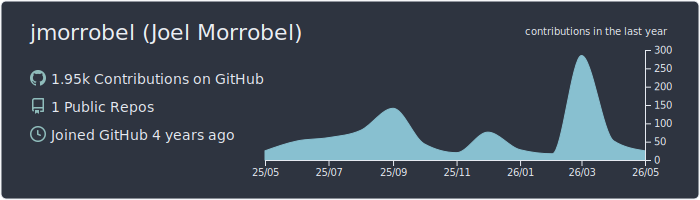

<h1 align="center">Hi, I'm Joel 👋</h1>

  <strong>Cloud Infrastructure Engineer · Full Stack Developer · IT Manager</strong> for <a href="https://www.resonancecompanies.com/" target="_blank" rel="noopener noreferrer">Resonance Companies</a> 
  AWS · DevOps · Sysadmin · Networking 
  Santiago, Dominican Republic 🇩🇴 · Bilingual EN / ES

  
  
  

---

### About me

I'm a Cloud and DevOps-oriented engineer and IT Manager with 5+ years across AWS infrastructure, CI/CD automation, networking, and on-premise IT operations — plus 4+ years of full-stack development in Python and JavaScript (React, Tailwind).

What I enjoy most is system design and infrastructure planning: choosing the right architecture and tools for each problem. The "right" part is where most of the time goes.

- 🔭 Currently building: a Supabase + React/Tailwind side project that started as "a quick thing" and now has a deployment diagram
- 🌱 Currently studying: **AWS Solutions Architect Associate**, one acronym at a time
- 🧪 Hobby projects exist mostly so I have an excuse to try the AWS service I just read about
---

### Tech Stack

**Cloud & Development**

  

**Systems, Networking & IT Operations**

  

---

### Certifications

- 🧭 **Cisco Certified Network Associate (CCNA)** · 2022
- 🔒 **Fortinet Network Security Expert 2 (NSE 2)** · 2020
- ☁️ **AWS Solutions Architect Associate** · *In progress*

---

### 📊 GitHub Stats

  

